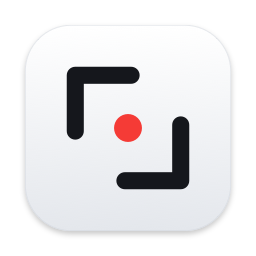

<h1 align="center">ChupViet</h1>

Chụp màn hình nhanh, chú thích gọn cho macOS — miễn phí. 
Fast screenshots &amp; clean annotations for macOS — free.

<a href="https://github.com/v52linhpt-del/chupviet/releases/latest/download/ChupViet.dmg"><b>⬇︎ Tải ChupViet / Download ChupViet</b></a> 
Luôn là bản mới nhất / Always the latest version

---

[Tiếng Việt](#tiếng-việt) · [English](#english)

## Tiếng Việt

### Tính năng

- **Chụp vùng chọn** (⌥⇧4) — màn hình đứng yên khi chọn, kính lúp chọn chính xác từng pixel
- **Chụp cửa sổ** (⌥⇧5) — kèm hoặc bỏ bóng đổ
- **Chụp toàn màn hình** (⌥⇧3)
- **Chụp cuộn** (⌥⇧6) — chụp cả trang dài hơn màn hình: chọn khung, bấm **Bắt đầu** rồi cuộn (hoặc **⬇** để app tự cuộn tới cuối trang), xem trước ảnh ghép ngay bên cạnh, bấm Xong
- **Nhận dạng chữ** (⌥⇧2) — quét vùng có chữ, chép ngay vào bộ nhớ tạm (có tiếng Việt); đọc cả mã QR
- **Ghim ảnh** nổi trên mọi cửa sổ — kéo, đổi cỡ, chỉnh độ trong suốt, khoá bấm xuyên qua
- **Hẹn giờ chụp** 3 / 5 / 10 giây · **Lịch sử chụp** · **Ẩn biểu tượng màn hình nền** khi chụp
- **Ô xem nhanh** sau khi chụp — Chép · Lưu · Sửa · kéo thả thẳng vào Slack, Zalo, Finder…
- **Hai màn hình** (laptop + màn trình chiếu): ô xem nhanh **đi theo chuột** sang màn bạn đang dùng
- **Trình sửa ảnh** — cắt, mũi tên, chữ, khung, hình tròn, bút, dạ quang, làm mờ, pixel hoá, đánh số 1-2-3
- **Tô sáng** — làm nổi một vùng, phần còn lại tối đi
- **Tự che thông tin nhạy cảm** — một nút bấm là che số điện thoại, email, số tài khoản, số căn cước, số thẻ
- **Dịch chữ trong ảnh** — Anh ⇄ Việt ngay trên máy, đặt bản dịch đè lên ảnh được (macOS 15 trở lên)
- **Nền trang trí** — nền chuyển sắc / một màu, lề, bo góc, đổ bóng, khung 1:1 · 4:3 · 16:9 cho bài đăng, slide
- **Chèn ảnh** — dán, kéo thả hoặc chọn tệp, kéo góc đổi cỡ
- **Chia sẻ** — AirDrop, Tin nhắn, Mail… ngay từ ô xem nhanh
- **Lưu được để sửa lại** — mở lại ảnh đã lưu, các chú thích vẫn sửa / xoá được
- **Phím tắt** đổi được tuỳ ý · giao diện tiếng Việt và tiếng Anh (đổi trong Cài đặt › Chung › Ngôn ngữ)

### Yêu cầu

macOS 14 (Sonoma) trở lên · Mac chip Apple (M1…) hoặc Intel.

### Cài đặt

1. Tải **[ChupViet.dmg](https://github.com/v52linhpt-del/chupviet/releases/latest/download/ChupViet.dmg)** (luôn là bản mới nhất).
2. Mở tệp `.dmg`, **kéo ChupViet vào ô Applications** bên cạnh. ⚠️ Đừng mở app ngay trong cửa sổ `.dmg`.
3. **Lần đầu mở app**, macOS sẽ báo *"Apple không thể xác minh ChupViet…"* — vì ChupViet chưa đăng ký
   chữ ký của Apple (tốn phí hằng năm). Cách mở:
   - Bấm **Xong**, rồi vào **Cài đặt hệ thống › Quyền riêng tư & Bảo mật**, kéo xuống dưới, thấy dòng
     *"ChupViet đã bị chặn…"* thì bấm **Vẫn mở** và nhập mật khẩu máy.
4. **Cấp quyền Ghi màn hình** khi app hỏi: **Cài đặt hệ thống › Quyền riêng tư & Bảo mật › Ghi màn hình &
   âm thanh hệ thống** › bật **ChupViet** › thoát app và mở lại.

5. *(Tuỳ chọn)* Muốn dùng **tự cuộn** khi chụp cuộn: bật ChupViet ở **Cài đặt hệ thống › Quyền riêng tư &
   Bảo mật › Trợ năng**. Không bật thì vẫn chụp cuộn được bằng cách tự cuộn chuột.

ChupViet chạy ở **thanh menu** (biểu tượng khung ngắm góc trên bên phải), không có biểu tượng ở Dock.

**Ảnh lưu ở đâu?** Thư mục **ChupViet trên Màn hình nền** (đổi được trong Cài đặt › Chung). Lần lưu đầu tiên
macOS có thể hỏi *"ChupViet muốn truy cập tệp trong thư mục Màn hình nền"* — bấm **Cho phép**.

### Cập nhật lên bản mới

Tải bản mới, kéo đè vào Applications. ⚠️ Sau mỗi lần cập nhật, macOS có thể coi là app mới và đòi
**cấp lại quyền Ghi màn hình**: chọn ChupViet trong danh sách quyền, bấm **−** để xoá, mở lại app và cấp lại.

### Cách dùng nhanh

| Việc | Phím |
|---|---|
| Chụp vùng chọn | ⌥⇧4 (giữ Option + Shift, bấm 4) |
| Chụp cửa sổ | ⌥⇧5 |
| Chụp toàn màn hình | ⌥⇧3 |
| Chụp cuộn | ⌥⇧6 |
| Nhận dạng chữ (OCR) | ⌥⇧2 |

Khi chọn vùng: **Shift** = khung vuông · giữ **Space** khi kéo = dời vùng · **Space** trước khi kéo = chọn
cửa sổ · **Esc** = huỷ. Trong trình sửa: **A** mũi tên · **T** chữ · **R** khung · **B** làm mờ ·
**N** đánh số · **C** cắt · **⌘Z** hoàn tác · **⌘S** lưu.

### Quyền riêng tư

ChupViet chạy **hoàn toàn trên máy bạn**: không cần mạng, không gửi ảnh hay dữ liệu nào đi đâu.

### Góp ý, báo lỗi

Mở một mục ở [Issues](https://github.com/v52linhpt-del/chupviet/issues).

### Điều khoản

ChupViet là **phần mềm miễn phí, mã nguồn đóng**: dùng thoải mái, không được sửa đổi hay phát hành lại.
Xem [LICENSE.txt](LICENSE.txt).

---

## English

### Features

- **Capture area** (⌥⇧4) — frozen screen while selecting, pixel-precise magnifier
- **Capture window** (⌥⇧5) — with or without shadow
- **Capture fullscreen** (⌥⇧3)
- **Scrolling capture** (⌥⇧6) — capture pages longer than the screen: select, click **Start** and scroll (or **⬇** to auto-scroll to the end), with a live preview, then Done
- **Capture text (OCR)** (⌥⇧2) — copy text from any area (Vietnamese supported); reads QR codes too
- **Pin screenshots** above all windows — move, resize, set opacity, click-through lock
- **Self-timer** 3 / 5 / 10 s · **Capture history** · **Hide desktop icons** in captures
- **Quick access overlay** — Copy · Save · Annotate · drag straight into any app
- **Multiple displays**: the overlay **follows your mouse** to the display you're using
- **Annotation editor** — crop, arrow, text, rectangle, ellipse, pen, highlighter, blur, pixelate, step counter
- **Spotlight** — highlight an area, dim the rest
- **Auto-redact** — one click hides phone numbers, emails, account / ID / card numbers
- **Translate text in images** — on-device, and place the translation over the image (macOS 15+)
- **Backgrounds** — gradient / solid backgrounds, padding, rounded corners, shadow, 1:1 · 4:3 · 16:9 frames
- **Insert images** — paste, drag in or pick a file, resize by the corners
- **Share** — AirDrop, Messages, Mail… straight from the overlay
- **Re-editable saves** — reopen a saved screenshot and your annotations are still editable
- **Custom shortcuts** · Vietnamese & English interface (switch in Settings › General › Language)

### Requirements

macOS 14 (Sonoma) or later · Apple silicon or Intel Mac.

### Install

1. Download **[ChupViet.dmg](https://github.com/v52linhpt-del/chupviet/releases/latest/download/ChupViet.dmg)** (always the latest version).
2. Open the `.dmg` and **drag ChupViet onto the Applications folder** next to it. ⚠️ Don't launch the app from inside the `.dmg` window.
3. **On first launch** macOS says *"Apple could not verify ChupViet…"* because the app isn't notarized yet.
   Click **Done**, then go to **System Settings › Privacy & Security**, scroll down to *"ChupViet was
   blocked…"* and click **Open Anyway**.
4. **Grant Screen Recording** when asked: **System Settings › Privacy & Security › Screen & System Audio
   Recording** › turn on **ChupViet** › quit and reopen the app.

5. *(Optional)* To use **auto-scroll** in scrolling capture, turn on ChupViet in **System Settings › Privacy &
   Security › Accessibility**. Without it you can still scroll by hand.

ChupViet lives in the **menu bar** (viewfinder icon, top right) — no Dock icon.

**Where are screenshots saved?** In a **ChupViet folder on your Desktop** (change it in Settings › General). The
first time, macOS may ask to let ChupViet access your Desktop folder — click **Allow**.

### Updating

Download the new version and replace the old one in Applications. ⚠️ macOS may treat each update as a new
app and ask for **Screen Recording permission again**: select ChupViet in that list, click **−**, reopen
the app and grant it again.

### Privacy

ChupViet runs **entirely on your Mac**: no network access, no images or data ever leave your computer.

### Feedback

Open an [issue](https://github.com/v52linhpt-del/chupviet/issues).

### License

ChupViet is **free, closed-source software**: free to use, not to be modified or redistributed.
See [LICENSE.txt](LICENSE.txt).
